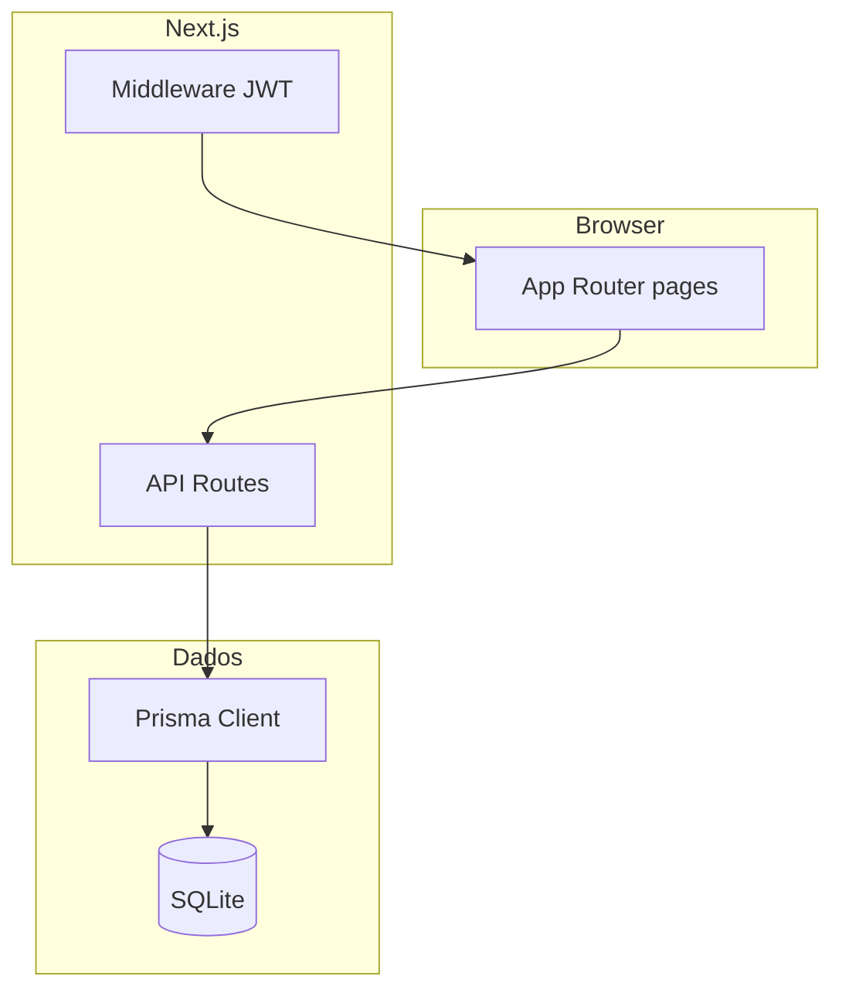
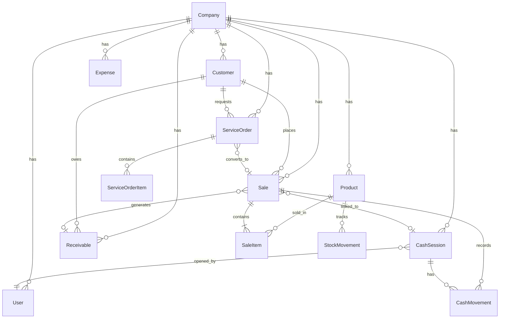
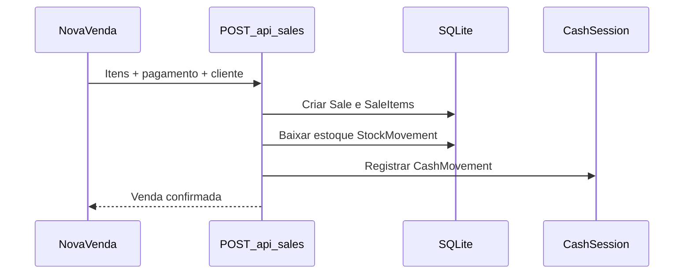
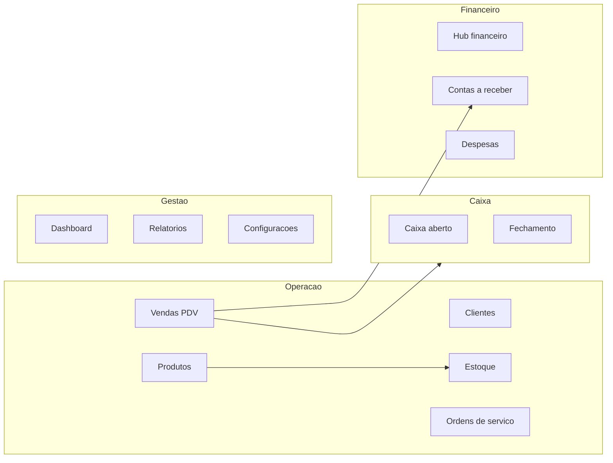

# Diagramas — GestãoSimples

Diagramas de arquitetura e modelo de dados. Versões resumidas também aparecem no [README principal](../../README.md).

## Arquitetura em camadas

O middleware valida o cookie `gestao_session` (JWT) em rotas protegidas. Páginas server-side e API routes compartilham o mesmo processo Node.

## Modelo de dados (simplificado)

Entidades principais do schema Prisma:

## Fluxo de venda

Pagamento pendente gera `Receivable` em vez de movimento imediato no caixa.

## Domínios funcionais

## Referências

- Schema completo: [`prisma/schema.prisma`](../../prisma/schema.prisma)
- ADR stack: [`docs/adr/001-stack.md`](../adr/001-stack.md)
- OpenSpec: [`openspec/specs/`](../../openspec/specs/)
